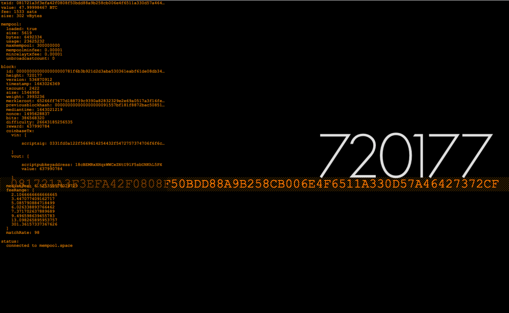

# Bitcoin Block Clock
macOS screensaver powered by mempool.space 's awesome API

This saver requires an internet connection, otherwise nothing interesting is displayed.

## Info

Includes a tweaked version of [GeoSans Light](https://www.dafont.com/geo-sans-light.font) font, created by [Manfred Klein](https://www.fontzillion.com/fonts/manfred-klein/geo-sans-light). I had some kerning issues, so converted the TTF to WOFF2 using 'Font-face Generator' on Font Squirrel.

I took a chunk of code from [Word Clock Screensaver](https://github.com/chrstphrknwtn/word-clock/) -> .xib + .h + .m to get this initial version up and running.

## Install

Download ('Bitcoin Block Clock.saver')[https://github.com/disuye/Bitcoin-Block-Clock/blob/main/Bitcoin%20Block%20Clock%20v.1.0.1.saver.zip] or compile everything yourself using the Xcode project.

Tested on macOS 10.12 thru 11.4. May or may not work on other versions. 

## Issues

On older versions of macOS you have the option for the screensaver to target Main, All or Last Used Display in System Preferences. On newer macOS versions these screen options are not always available. I'm close to fixing this bug, hopefully in the next version.
